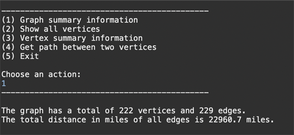
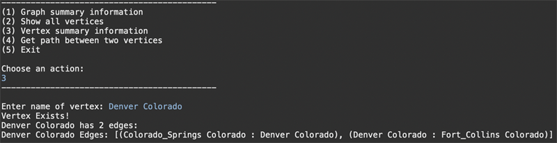

# Interstate

Interstate is a mapping program for US interstate highways. It is written in Java and uses JGraphT library as a dependency.

### Works On

Linux, Mac OS, and Windows

>[!NOTE]
>Newer releases of JGraphT throw errors at runtime. Version 0.9.1 is included as a .jar in the folder "interstate"
>For other versions or to use JGraphT via Maven: https://jgrapht.org/

### Run On Terminal

1. Download files and unzip
2. Open Terminal/Command Line and navigate to Interstate directory
3. Enter following commands:

```java
javac -cp lib/jgrapht-core-0.9.1.jar interstate.java
java -cp .:lib/jgrapht-core-0.9.1.jar interstate `cat interstate.txt`
```

 


